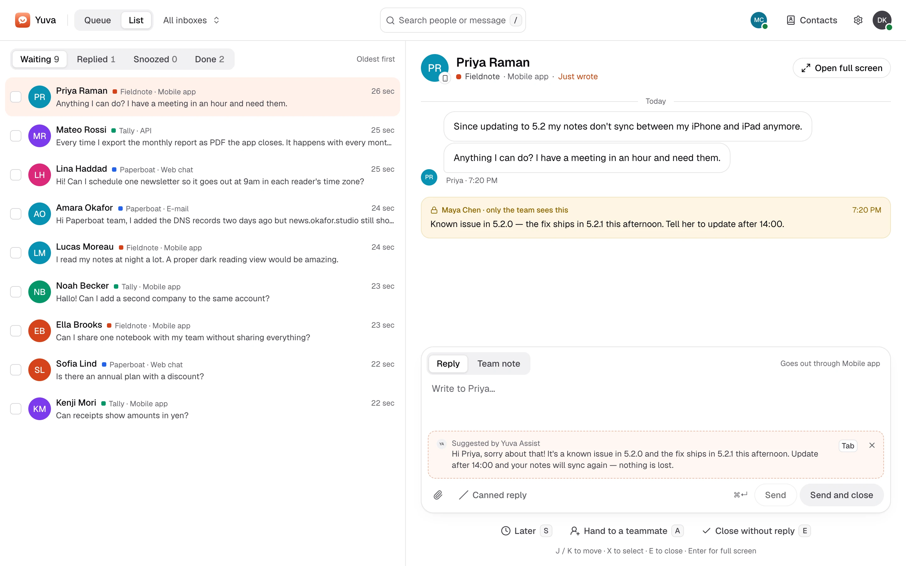

<div align="center">


# Yuva

**One inbox for every product you run.**

Open-source customer messaging: support e-mail, live chat and in-app conversations from all of your
products in one shared inbox. Self-hosted, one Go binary with Postgres.

[Website](https://useyuva.com) · [Docs](docs/install.md) · [API](openapi/openapi.yaml) ·
[Releases](https://github.com/productdevbook/yuva/releases) · [Roadmap](docs/roadmap.md)

[](https://github.com/productdevbook/yuva/releases)
[](https://github.com/productdevbook/yuva/actions/workflows/ci.yml)
[](LICENSE)
[](sdk/LICENSE)

</div>

<picture>
  <source media="(prefers-color-scheme: dark)" srcset=".github/assets/panel-dark.webp">
  
</picture>

> [!WARNING]
> **Pre-alpha.** The API and database schema can change without migration paths, and the code has
> not had an independent security audit. Try it with test data, not real customer conversations.

## Why Yuva

- **Every product, one inbox.** Each product is an inbox with its own branding, language, hours
  and team. Members see only the inboxes they were given.
- **Every channel, one conversation.** E-mail with proper threading, live chat with the
  `<yuva-chat>` web component, in-app messages and feedback through native iOS and Android SDKs,
  and an API for everything else.
- **Your users stay yours.** Your backend signs a short-lived identity token; Yuva never sees your
  user database. Signed webhooks let your backend send its own push notifications.
- **Headless when you want it.** Scoped API keys, bots that write drafts for a member to send, an
  event feed and a headless JS client let you build your own inbox, chat and automations.
- **Works with AI assistants.** A built-in MCP server lets Claude, ChatGPT, Cursor and other
  assistants triage and draft replies, signed in as you with OAuth. Yuva runs no model itself.
- **Small to run.** One Docker image and Postgres. No Redis, no separate workers.

## Quick start

```sh
docker pull ghcr.io/productdevbook/yuva:0.0.3
```

1. Write `compose.yaml` and `.env` from the [install guide](docs/install.md#quick-start-with-compose).
2. Start it: `docker compose up -d`.
3. Create the first owner:
   `docker compose exec yuva /yuva bootstrap --email you@example.com --workspace "Example"`.
4. Put it behind HTTPS and sign in with the code that arrives by e-mail.

## Documentation

| Get started | Channels | Integrate | Build on it |
|---|---|---|---|
| [Install](docs/install.md) | [E-mail](docs/email.md) | [Identity tokens](docs/identity.md) | [Headless](docs/headless.md) |
| [Configuration](docs/configuration.md) | [Web widget](docs/widget.md) | [Webhooks](docs/webhooks.md) | [AI assistants (MCP)](docs/mcp.md) |
| [Operations](docs/operations.md) | [Mobile SDKs](docs/mobile.md) | [API contract](openapi/openapi.yaml) | [Examples](examples) |

How it is built: [architecture](docs/architecture.md). What is next: [roadmap](docs/roadmap.md).
What changed: [changelog](CHANGELOG.md).

## Repository

| Path | What | License |
|---|---|---|
| `api/` | Go server: API, realtime, e-mail, jobs | AGPL-3.0 |
| `web/` | Team panel (React) | AGPL-3.0 |
| `edge/` | Cloudflare Email Worker for inbound mail | AGPL-3.0 |
| `site/` | Website and documentation | AGPL-3.0 |
| `deploy/` | Docker and Compose | AGPL-3.0 |
| `openapi/` | API contract | MIT |
| `sdk/js` | `@useyuva/js`: headless client, `<yuva-chat>`, React hooks, typed `/v1` client | MIT |
| `sdk/swift`, `sdk/kotlin` | iOS and Android SDKs | MIT |
| `sdk/go` | Typed `/v1` client, identity tokens and webhook verification | MIT |
| `examples/` | Headless chat, event feed and draft bot | MIT |

## Contributing

Issues and pull requests are welcome; read [CONTRIBUTING.md](CONTRIBUTING.md) first. Contributions
are made under the [CLA](CLA.md). Report security issues privately as described in
[SECURITY.md](SECURITY.md).

## License

The server and panel are [AGPL-3.0](LICENSE); the SDKs and the API contract are [MIT](sdk/LICENSE),
so they ship inside closed-source apps without copyleft obligations. Details in
[LICENSING.md](LICENSING.md). The name and logo are covered by [TRADEMARK.md](TRADEMARK.md).

<div align="center">
<sub>“Yuva” is Turkish for nest, or home.</sub>
</div>
